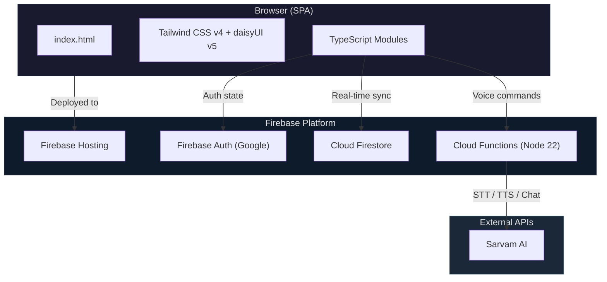
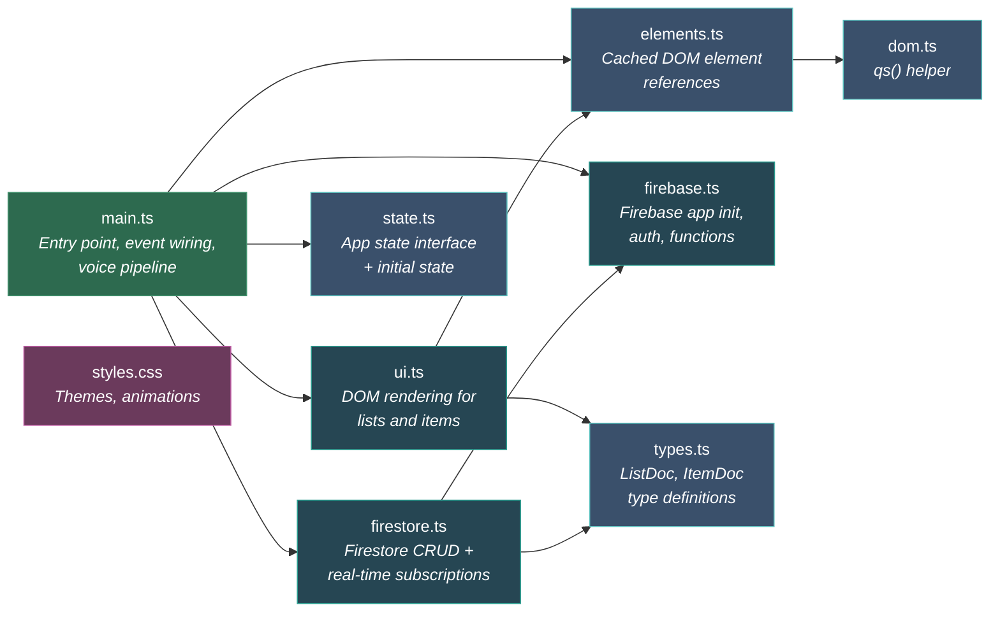
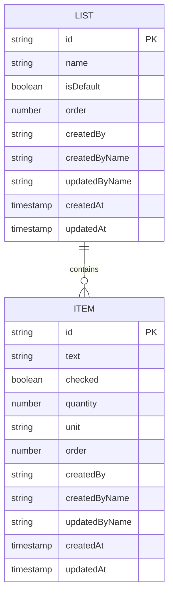
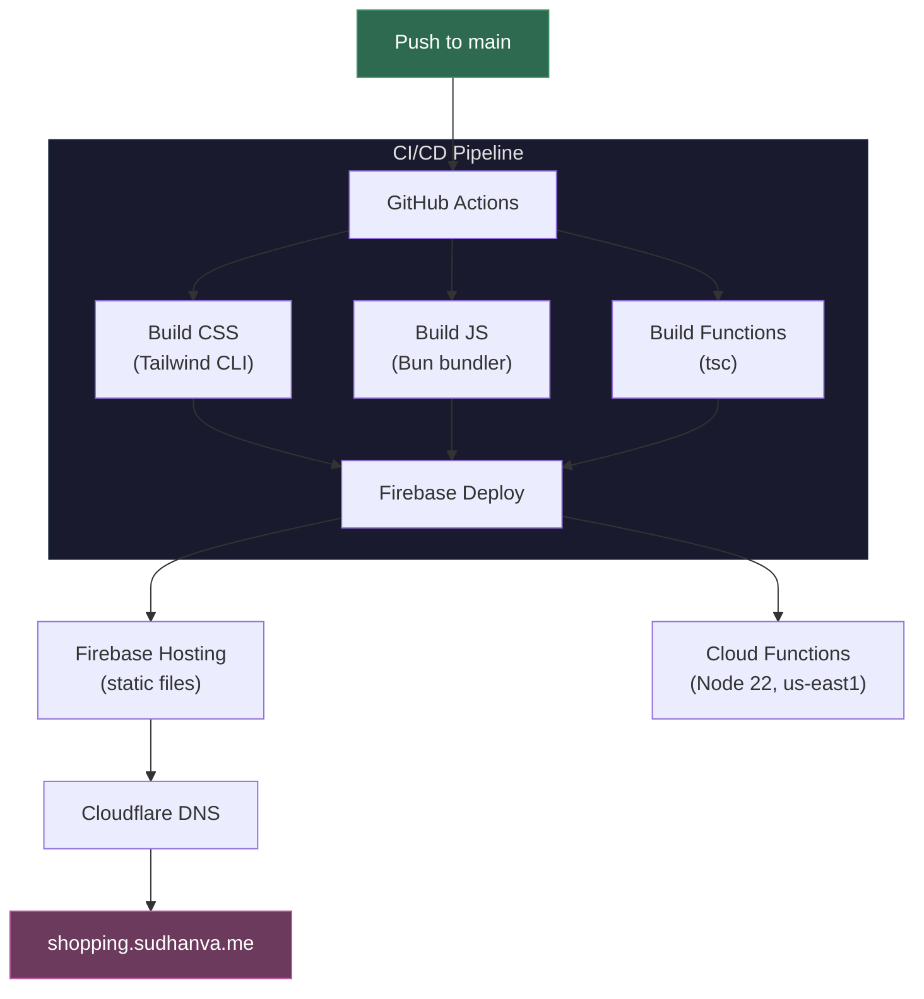
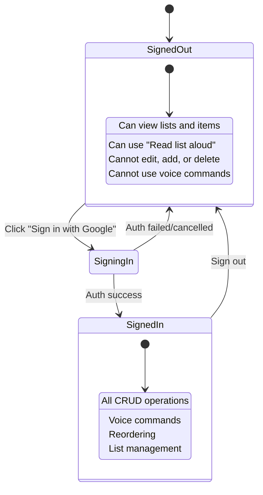

# Shopping

Fast, shared shopping lists built with Bun + TypeScript + Firebase + daisyUI.

## Features

- Shared lists with items (public read, Google-auth write)
- Add, edit, check/uncheck, delete items
- Inline quantity per item (decimal, defaults to 1) with +/- controls
- Optional unit per item (e.g., kg, lb)
- Check all / Uncheck all / Clear checked / Clear all
- Rename lists (header + sidebar)
- Delete lists with choice to delete items or move them to Inbox
- Reorder lists and items
- Created/edited-by metadata for lists and items
- Voice commands (add items, check/uncheck, delete, navigate lists)
- Text-to-speech responses and list readout
- Dark mode default with light mode toggle
- Mobile hamburger drawer for Lists (CSS-only)
- Remembers the last selected list across tab closes
- Responsive layout with left nav

## Architecture

### High-Level Overview



### Frontend Module Graph



### Data Model



### Voice Command Pipeline

```mermaid
flowchart LR
    Mic["🎤 Tap Mic"] --> Modal["Voice Modal<br/>(recording)"]
    Modal --> Send["Tap Send"]
    Send --> B64["Base64 encode<br/>audio blob"]
    B64 --> CF["Cloud Function<br/><b>parseVoiceCommand</b>"]

    subgraph CloudFunction["Cloud Function (us-east1)"]
        CF --> STT["Sarvam STT<br/>(saaras:v3)"]
        STT --> Transcript["Transcript text"]
        Transcript --> Chat["Sarvam Chat<br/>(sarvam-m)"]
        Chat --> Intent["JSON Intent"]
    end

    Intent --> Execute["Execute intent<br/>(add/edit/delete/...)"]
    Execute --> TTS["Cloud Function<br/><b>speakText</b>"]
    TTS --> SarvamTTS["Sarvam TTS<br/>(bulbul:v3)"]
    SarvamTTS --> Audio["🔊 Play audio"]

    style Mic fill:#2d6a4f,stroke:#40916c,color:#fff
    style Modal fill:#2d6a4f,stroke:#40916c,color:#fff
    style CloudFunction fill:#1b2838,stroke:#2a4858,color:#e0e0e0
```



### Voice Intent Types

```mermaid
mindmap
    root((Voice Intents))
        Items
            add_item
            add_items_bulk
            edit_item_text
            set_quantity
            set_unit
            check_item
            uncheck_item
            delete_item
            move_item
        Bulk Operations
            check_all
            uncheck_all
            clear_checked
            clear_all
        Lists
            create_list
            select_list
            rename_list
            delete_list
            move_list
        Other
            read_items
            clarify
            unknown
```

### Deployment Flow



### Authentication & Authorization



## Tech

- Bun + Vanilla TypeScript
- Tailwind CSS v4 + daisyUI v5 for styling
- Firebase Hosting + Firestore (Native mode)
- Firebase Auth (Google)
- Sarvam AI (STT, TTS, Chat)

## Setup

```bash
bun install
bun run build
bun run serve
```

Open `http://localhost:3000`

### Dev Loop

```bash
bun run dev
```

## Firebase

```bash
bunx firebase-tools login
bunx firebase-tools use sudhanva-personal
bunx firebase-tools deploy
```

Enable Google provider in Firebase Auth Console and add your domains to authorized domains.

### Cloud Functions (Voice Control)

Voice control uses Firebase Cloud Functions in `us-east1` and Sarvam APIs for STT + intent parsing + TTS.

```bash
firebase functions:secrets:set SARVAM_API_KEY
```

Then deploy:

```bash
bunx firebase-tools deploy --only functions
```

Voice UX in app:

- Tap the mic button to open the voice modal
- Speak your command, then tap Send
- App transcribes → parses intent → executes → speaks result
- If ambiguous, app asks a follow-up clarification
- Signed-out users can only use `Read list aloud`

## Firestore Rules

Rules live in `firestore.rules`. Reads are public, writes require auth and strict schema.

## Cloudflare DNS (Optional)

- CNAME `shopping.sudhanva.me` → `sudhanva-shopping-app.web.app`
- Add the TXT record for domain verification

## GitHub Actions Deploy

On push to `main`, the workflow deploys Firebase Hosting + Cloud Functions.

Required secret: `FIREBASE_SERVICE_ACCOUNT_SUDHANVA_PERSONAL`
